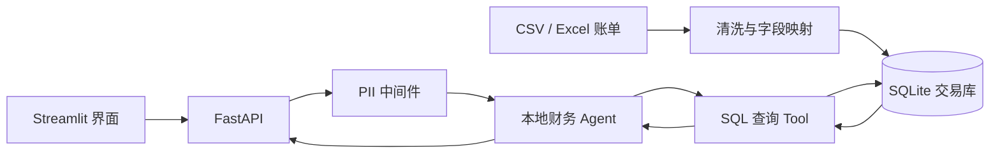

# FinAgent：设计与改进

## 1. 项目背景

FinAgent 是一个用于实践 Agent 工具调用的个人财务助理项目。用户可以导入 CSV 或 Excel 账单，再通过自然语言询问消费金额、商户和时间范围等问题。Agent 根据问题生成查询，调用本地数据库工具，并把结果整理成易读回答。

个人账单包含交易时间、金额和消费描述等敏感信息，因此项目选择本地 Ollama 模型和 SQLite 数据库，重点验证“数据导入 → Agent 查询 → 财务回答”的本地闭环，以及 PII 脱敏中间件如何接入 Agent。

## 2. 设计目标

系统主要围绕五个目标设计：

1. **账单可以统一导入**：对 CSV、Excel、不同编码和常见列名进行基础清洗，转换为统一交易模型。
2. **自然语言可以查询数据**：用户不需要编写 SQL，由 Agent 判断问题并调用数据库工具。
3. **敏感数据尽量留在本地**：模型、数据库和应用均可在本机运行，减少财务数据发送到外部服务。
4. **Agent 行为有工具边界**：模型通过指定工具读取交易数据，不直接凭空回答金额类问题。
5. **界面与业务逻辑分离**：Streamlit 负责交互，FastAPI 负责接口，Service 与数据库层负责数据处理。

### 2.1 同类方案调研与个人实践定位

个人财务领域已经有成熟的预算管理、账务管理和 AI 财务助手产品。这个项目的调研目的不是寻找可以取代的商业竞品，而是了解现有方案如何处理财务功能、自然语言交互和数据隐私，并据此确定适合个人源码实践的范围。

| 同类方案 | 公开能力与数据 | 成熟方案的优势 | 对 FinAgent 的启发与差异 |
|---|---|---|---|
| [Monarch Money](https://help.monarch.com/hc/en-us/articles/37526856682260-AI-in-Monarch) | 已提供 AI Assistant、消费洞察、交易分类、周报和票据识别；官方说明部分功能使用第三方 LLM，并限制传输字段，约定第三方不保留数据且不用于训练 | 账户连接、交易治理、预算分析和用户体验已经形成完整产品，也对 AI 数据使用给出明确说明 | 证明自然语言查询个人财务数据具有实际应用价值；FinAgent 不实现完整财务产品，而是用 Ollama 实践账单、工具结果和对话上下文在本机流转 |
| [Actual Budget](https://actualbudget.org/docs/getting-started/sync/) | 约 2.86 万 GitHub Stars；采用 local-first 架构，数据默认保存在本地设备，并支持自托管和可选的端到端加密同步 | 在预算管理、多设备同步和用户掌握数据方面更加成熟 | 它验证了本地优先是个人财务应用中成立的设计选择；FinAgent 的练习重点进一步收窄到本地模型、自然语言查询和 Agent Tool 调用 |
| [Firefly III](https://github.com/firefly-iii/firefly-iii) | 约 2.45 万 GitHub Stars；支持自托管、复式记账，并提供覆盖主要功能的 REST API | 财务数据模型、账户管理、预算、报表和系统扩展能力完整 | 它为自托管财务系统提供了成熟参照；FinAgent 只使用简化交易模型，重点观察账单导入、SQL Tool 和模型回答之间的数据链路 |

调研形成了三个判断：

1. **本地运行本身不是完整的隐私方案**：Actual Budget 的本地优先和端到端加密说明，数据存储、同步、密钥和设备安全都需要分别考虑。FinAgent 当前只验证数据与推理留在本机的基本路径，不能等同于完整的数据安全体系。
2. **自然语言交互必须建立在可靠账务数据之上**：Monarch Money 和 Firefly III 的成熟能力来自账户、交易、分类和规则等基础数据。FinAgent 因此要求模型通过数据库工具取数，而不是依靠对话上下文猜测金额。
3. **个人实践应聚焦可以观察的工程问题**：完整预算、账户同步和复式记账需要大量领域规则。项目把范围控制在数据导入、本地模型、工具调用与 PII 中间件，以便直接观察 Agent 的输入、决策和查询结果。

### 2.2 为什么仍然自己实现

直接使用成熟财务软件可以更快获得预算管理和消费分析能力，但无法替代一次 Agent 应用的源码级实践。我选择自己实现，是为了完整经历账单文件进入系统后的处理过程：识别不同格式、映射交易字段、写入本地数据库、让模型选择查询工具、执行 SQL、整理查询结果，并在 Agent 输入链路中加入隐私规则。

项目验证的核心不是“AI 会不会回答财务问题”，而是三个更具体的问题：

1. 模型能否通过受控工具查询真实交易数据，而不是直接生成看似合理的金额。
2. 账单、用户问题和工具返回结果能否在本地模型与本地数据库之间完成闭环。
3. 信用卡号等敏感信息的处理能否作为中间件接入，而不是重复写入每个页面、接口或提示词。

因此，FinAgent 只建设“导入账单 → 自然语言提问 → Agent 调用数据库工具 → 返回财务结果”的最小闭环，不以替代 Monarch Money、Actual Budget 或 Firefly III 为目标。当前版本缺少账户自动同步、复式记账、预算规划、交易对账、完整数据加密和可靠的 SQL 查询沙箱，这些差距明确限定了它是 Agent 工具调用与隐私边界的个人实践项目，并非可以直接用于真实财务管理的完整产品。

## 3. 设计过程

### 阶段一：建立交易数据模型

第一步先定义统一的交易结构，包括时间、金额、币种、原始描述和来源文件，并为后续分类、商户识别、标签和周期性消费预留字段。然后实现 CSV 与 Excel 上传，将常见账单列名映射为内部字段后写入 SQLite。

### 阶段二：接入本地大模型

考虑到账单的隐私属性，项目使用 Ollama 在本地运行模型。系统提示中提供交易表结构，并要求模型优先查询数据库，不根据常识猜测用户的消费情况。

### 阶段三：把数据库查询封装成 Agent Tool

数据库查询被封装为 LangChain Tool，并绑定到财务 Agent。用户提问后，Agent 可以决定是否调用工具、生成 SQL、读取结果，再组织最终回答。这样模型负责理解问题，程序负责访问真实数据。

### 阶段四：加入 PII 中间件

为了实践 Agent 中间件机制，项目增加了信用卡号识别与遮盖。用户输入在进入模型前经过检测，符合模式的敏感数字会被替换，从而验证隐私规则可以作为横向能力接入 Agent，而不需要写进每个业务提示词。

### 阶段五：补充 API、界面和容器化

FastAPI 提供账单上传和聊天接口，Streamlit 提供文件上传与对话界面，Docker Compose 用于尝试组合后端、前端、数据库文件和宿主机 Ollama。项目由此形成一个可以继续扩展的完整练习骨架。

## 4. 总体架构

文件上传和聊天查询使用两条独立路径：上传链负责把外部账单转换成统一交易数据；问答链负责让本地 Agent 通过受控工具查询数据库。两条路径最终共享同一份 SQLite 数据。

## 5. 关键技术决策

### 5.1 使用本地模型处理财务问题

财务数据比普通聊天内容更敏感。账单原文可能包含姓名、商户、地点和交易备注；即使用户只问“上个月花了多少”，Agent 查询后交给模型的中间结果仍包含金额、时间和消费习惯。若直接调用云端模型，这些提示、工具结果和上下文都可能离开本地环境。

因此项目优先使用 Ollama 本地部署模型，让账单文件、SQLite 数据、用户问题和 SQL 查询结果在同一台设备内流转。PII 中间件继续处理输入中的明显敏感号码，作为本地数据边界之外的第二层保护。

这个选择也有明确代价：本地模型受硬件、推理速度和模型能力限制，模型安装与升级需要用户维护。对于个人账单查询场景，我认为隐私收益高于这些成本，因此先选择能力足够的小型本地模型，并保留模型接口，后续可以在用户明确授权且数据已脱敏时接入其他推理方式。

### 5.2 模型负责理解，工具负责取数

系统要求 Agent 在回答金额、商户和时间统计问题时调用查询工具。模型不保存交易事实，SQLite 才是数据来源。这样可以减少模型根据对话内容编造财务数字的问题。

### 5.3 先标准化数据，再进行智能分析

支付宝、微信或银行导出的文件可能使用不同列名、编码和金额格式。导入层先完成字段重命名、金额清洗、日期转换和缺失值处理，下游 Agent 只面对统一表结构。

### 5.4 用中间件承载通用隐私规则

PII 处理位于 Agent 输入链路中，而不是散落在页面或具体问题提示里。以后可以继续增加手机号、身份证号和银行卡号等规则，也可以分别决定遮盖、拦截或替换策略。

### 5.5 前端、接口和数据层分开

Streamlit 通过 HTTP 调用 FastAPI，文件解析放在 Service 层，数据库连接由 Core 层维护。这个结构便于分别替换页面、模型和存储方式，也让 Agent 逻辑不直接依赖界面状态。

## 6. 问题解决与改进

### 6.1 不同账单格式难以统一查询

**问题**：不同平台导出的文件在编码、列名和金额格式上存在差异，直接入库会导致 Agent 需要理解多套结构。

**方案**：导入时统一识别 CSV 与 Excel，对常见中文列名进行映射，并规范日期、金额、空描述和来源文件。

**结果**：数据库保持稳定结构，查询工具和提示词不需要随账单来源变化。

### 6.2 模型容易直接猜测财务结果

**问题**：如果只给模型一个聊天入口，它可能不查询数据库就回答金额问题。

**方案**：在系统提示中声明数据库结构和取数规则，并把 SQL 查询注册为 Agent Tool。

**结果**：自然语言理解与真实数据查询形成一条可观察的工具调用链。

### 6.3 财务数据不适合发送到外部模型

**问题**：账单描述和交易记录可能暴露个人身份、消费地点与生活习惯。

**方案**：模型和数据库默认在本地运行，同时在 Agent 输入前加入 PII 遮盖。

**结果**：项目验证了本地模型与隐私中间件结合的基本方案。

### 6.4 同步文件处理会阻塞界面逻辑

**问题**：文件读取、清洗和数据库写入不应与页面代码混在一起，否则后续增加校验和批量处理会难以维护。

**方案**：将文件处理放入独立 Service，FastAPI 使用异步数据库会话完成写入，页面只负责上传和显示结果。

**结果**：交互层与数据处理职责分开，后续可以独立增加导入进度、去重和错误报告。

## 7. AI 在项目中的使用方式

AI 主要用于辅助学习和实现 Agent 应用：

- 讨论本地财务助理的功能范围和数据模型。
- 设计“用户问题 → Agent → SQL Tool → 数据库 → 回答”的调用流程。
- 辅助实现 FastAPI、SQLModel、LangChain Agent、PII 中间件和 Streamlit 页面。
- 根据真实报错调整文件读取、异步数据库和工具绑定方式。
- 分析隐私、SQL 安全和容器运行中的边界，并整理后续改进项。

我的工作重点是定义数据边界、选择本地模型方案、拆分模块、运行代码并判断结果是否符合真实财务查询。开发过程采用“小范围实现 → 本地运行 → 根据结果修正”的方式逐步完成。

## 8. 验证方式与当前限制

当前项目可以通过手动上传账单验证字段清洗和数据库写入，通过调试脚本或聊天页面观察 Agent 是否调用 SQL Tool，并使用不同格式的问题检查返回结果。FastAPI 根接口、上传接口和聊天接口可以分别验证，数据库文件可用于核对实际入库数据。

作为个人实践项目，目前仍有以下改进空间：

- SQL Tool 目前使用关键词拦截写操作，仍需改为只读数据库连接、SQL 解析与表名白名单，才能形成更可靠的查询沙箱。
- 查询结果直接转换为字符串，后续应增加行数限制、字段过滤和结构化返回，避免一次读取过多数据。
- PII 中间件目前主要验证信用卡号遮盖，规则范围和输出链路仍需扩展。
- 账单导入需要补充文件大小、必填列、重复记录、空表和异常日期等校验。
- 当前主要依赖手动调试，应增加不调用真实模型的单元测试、接口测试和 Agent 工具测试。
- Docker 配置、Python 版本和前端启动入口需要统一后再作为稳定部署方案。
